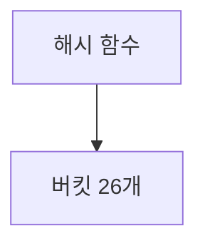

# 학습 트래커

여러 과목(CS50x, React, Bitcoin 등)을 병행 학습하면서 **날짜별로 뭘 했는지**와
**과목별로 얼마나 진행했는지**를 기록하고 한눈에 보는 개인용 대시보드.

AI 기능은 없다. 순수하게 기록하고 보여주기만 한다.
학습 질문이나 요약 생성은 claude.ai 에서 하고, 그 결과물을 여기에 붙여넣어 보관한다.

그 붙여넣기가 **칸칸이 손으로 옮기는 일**이 되지 않도록, claude.ai 가 만들어 준
정형 텍스트를 통째로 붙여넣으면 각 필드가 자동으로 채워진다.
→ [claude.ai 와 주고받기](#claudeai-와-주고받기)

> **다른 PC(사지방 등)에서 처음 시작한다면 → [docs/WORKFLOW.md](docs/WORKFLOW.md) 를 먼저 볼 것.**
> 코드와 학습 기록은 동기화 경로가 다르다. 그 문서에 체크리스트가 있다.

---

## 실행

```bash
npm install
npm run dev
```

| 명령 | 설명 |
|---|---|
| `npm run dev` | 개발 서버 (http://localhost:5173) |
| `npm run build` | `dist/` 로 정적 빌드 |
| `npm run preview` | 빌드 결과 미리보기 |

서버가 필요 없다. 데이터는 전부 브라우저 `localStorage` 에만 저장된다.

`base: './'` + HashRouter 조합은 **정적 호스팅(GitHub Pages)** 에 맞춘 것이다.
경로가 상대라 저장소 하위 경로(`/learning-tracker/`)에 올라가도 자산을 찾고,
HashRouter 라 서버 리라이트 설정 없이도 `/subjects/...` 같은 주소가 새로고침에서 살아남는다.

> `dist/index.html` 을 **파일로 직접 열면(`file://`) 동작하지 않는다.** 브라우저가
> ES 모듈을 `file://` 에서 CORS 로 차단하기 때문이다(origin 이 `null` 이라 무조건 거부).
> 정적 파일이라도 **HTTP 로 서빙**되어야 한다.

---

## 데이터 구조

3단 계층이지만 저장은 **중첩 객체가 아니라 평면 맵**으로 한다.

```
Subject (과목)          id, name, colorHue, customColor?, totalBlocks
  └─ Block (진도 단위)   id, subjectId, name, isCompleted, order
                        description, progressPercent?, diagramCode?, svgCode?
       └─ Entry (기록)   id, blockId, date, title?, tags[], content
                        diagramCode?, svgCode?, progressPercent?
```

Block 은 원래 Entry 를 담는 그릇이기만 했다. v3 에서 **자체 정보를 갖는 계층**이 되었다 —
"이 블록이 무엇을 다루는 단위인지"는 그 안의 기록들을 다 읽어야만 알 수 있는 것이 아니라,
블록 자신이 들고 있어야 하는 정보이기 때문이다.

```js
{ version, settings, subjects: {id: {...}}, subjectOrder: [], blocks: {...}, entries: {...} }
```

평면으로 두는 이유:

- 캘린더는 **날짜**로, 과목 화면은 **subjectId** 로 조회한다. 두 방향이 모두 필요하다.
- Entry 상세에서 소속 Block → Subject 로 O(1) 역참조가 된다 (반대 경로 점프).
- 완료 토글·수정·삭제가 깊은 중첩 불변 업데이트 없이 끝난다.

---

## 핵심 규칙

### 진도율

```
진도율(%) = isCompleted 인 Block 수 ÷ Subject.totalBlocks × 100
```

`totalBlocks` 는 전체 커리큘럼 기준값으로 **사용자가 직접 입력**한다.
실제로 만든 Block 수와 다를 수 있고, 목표를 넘으면 100% 로 막고 표시로 알려준다.

### 진행률이 세 군데 있는 이유

이름이 비슷해서 헷갈리기 쉽지만 **셋은 서로 다른 값이고, 하나로 합칠 수 없다.**

| | 어디에 | 누가 정하나 | 무엇을 답하나 |
|---|---|---|---|
| **과목 진도율** | Subject | 트래커가 계산 (완료 블록 ÷ totalBlocks) | 이 과목을 얼마나 끝냈나 |
| **블록 진행률** | Block.progressPercent | **claude.ai 가 계산해서 보내준 값을 그대로 보관** | 이 블록은 지금 어디쯤인가 |
| **기록 진행률** | Entry.progressPercent | 기록할 때 적어 둠 | 어떻게 여기까지 왔나 (추이 그래프) |

블록 진행률을 트래커가 계산하지 않는 것은 의도된 설계다. "해시 함수는 이해했고 Speller 는
절반쯤"을 숫자로 바꾸는 일은 학습 내용을 읽어야 가능한데, 그 판단은 claude.ai 쪽의 일이다.
트래커는 받아 적는다.

기록 진행률이 비어 있는 기록은 추이 그래프에서 **건너뛴다.** 0 으로 채워 이어 붙이면
"그날 진도가 0으로 떨어졌다"는 거짓 그래프가 된다.

### 색상

UI 팔레트는 Claude 의 톤을 따른다 — 배경 Near Black `#141413`, 포인트 Terracotta `#c96442`,
보조 Coral `#d97757`, 라이트 모드 배경 Parchment `#f5f4ed`.

과목 색은 두 갈래다.

1. **자동 배정 (`colorHue`)** — 한 번 정해지면 변하지 않는다.
2. **사용자 지정 (`customColor`)** — 있으면 렌더링에서 이것이 우선한다.

`customColor` 를 지정해도 `colorHue` 는 그대로 남는다. 골든 앵글 순서와 색 충돌 판정이
계속 `colorHue` 로만 이뤄지므로, 직접 고른 색이 자동 배정 순서를 흐트러뜨리지 않는다.

- **배정**: `colorHue = (205° + hueIndex × 137.5°) mod 360`. 골든 앵글이라 색이 고르게 퍼진다.
  `hueIndex` 는 정수 카운터다 — 각도가 아니라 정수여야 두 기기의 값을 `max()` 로 합칠 수 있다.
  과목을 삭제해도 그 색은 재사용하지 않는다.
- **예약 대역**: 15° ± 22° 는 배정하지 않는다. Terracotta 와 Coral 이 모두 hue 15° 근처라,
  그 부근의 과목 색은 버튼·강조 요소와 구별되지 않는다. 시작 각도를 205°(파랑)로 둔 것도
  첫 과목이 곧바로 포인트 컬러와 헷갈리지 않게 하기 위함이다.
- 자동 배정 규칙이 바뀌어도 **이미 만들어진 과목의 hue 는 건드리지 않는다.** 예전에 만든
  과목이 포인트 컬러와 비슷하다면 과목 설정에서 색을 직접 지정하면 된다.
- **활성도**: 회색 배경판 위에 색 레이어를 알파로 겹친다.

  ```
  [ 위 ]   hsl(H 70% 50% / α)     α = 1 − min(경과일, D) / D
  [ 아래 ] hsl(0 0% 72%)
  ```

  α 가 0이 되면 아래 회색이 그대로 드러나 무채색이 된다. **채도를 낮추지 않고** 무채색을 만드는 방법이다.
  `D` 는 `settings.inactivityDays` (기본 7일).

- **어디에 적용하나**: 활성도는 **과목 목록 카드**와 **연간 간트의 과목 라벨**에만 쓴다.
  캘린더 점은 "그날 뭘 했나"를 보는 것이라 활성도 개념이 필요 없고 **항상 불투명**하다.

### 연간 간트의 밀도

막대의 진하기는 활성도가 아니라 **활동 밀도**다 (두 변수를 한 채널에 섞지 않는다).

```
density = 기록 수 ÷ max(기간, 14일)
alpha   = 0.2 + 0.8 × (density / 최대밀도) ^ 1.8
```

- 지수 `1.8` 은 저활동 구간을 완만하게, 고활동 구간을 급격하게 만든다 (GitHub 잔디와 같은 느낌).
  `src/lib/color.js` 의 `DENSITY_EXPONENT` 하나만 고치면 된다.
- 14일 하한이 없으면 "하루에 한 번 기록하고 만 과목"이 밀도 1.0 으로 가장 진하게 나온다.

---

## 폴더 구조

```
src/
├── lib/          날짜·색상·id·제목 추출·클립보드·정형 텍스트·SVG 검증 (순수 함수)
├── storage/      스키마, localStorage 영속화, 검증, 병합, 내보내기/가져오기
├── state/        reducer, selectors, StoreProvider
├── routes/       화면 단위 컴포넌트
└── components/   재사용 UI
```

`storage/` 와 `state/` 는 브라우저 API 의존이 거의 없어 Node 로 단독 검증이 가능하다.

## claude.ai 와 주고받기

이 앱의 주 사용 흐름이다. 기록은 claude.ai 에서 만들고, 트래커는 그것을 **받아서 보관**한다.

```
  트래커 ──[내보내기]──▶ claude.ai ──[정형 텍스트]──▶ 트래커
   현재 상태를              정리·요약·계산            각 필드에 자동 반영
   참고용으로
```

### 버튼 네 개

| 버튼 | 위치 | 하는 일 |
|---|---|---|
| **⧉ 기록 내보내기** | 블록 상세 | 블록 소속 Entry 들을 클립보드로 |
| **⧉ 블록 정보 내보내기** | 블록 상세 | 블록 자체 정보(설명·진행률·다이어그램·SVG)를 클립보드로 |
| **⤓ 블록 정보 가져오기** | 블록 상세 | `---BLOCK---` 텍스트를 붙여넣어 블록 자체 정보에 반영 |
| **⤓ 기록 가져오기** | 기록 입력/추가 | `---ENTRY---` 텍스트를 붙여넣어 입력 폼을 채움 |

내보내기 둘은 **무엇이 복사되는지가 이름에 드러나야 한다.** 같은 화면에 있는데 둘 다
"내보내기"였다면 매번 눌러 보고 확인하게 된다.

### 정형 텍스트 형식

형식의 단일 진실 공급원은 `src/lib/structuredText.js` 다 (읽기·쓰기가 같은 파일에 있어야
한쪽만 고치는 사고가 없다).

````
---ENTRY---
날짜: 2026-09-18          ← 한 줄짜리 값
과목: CS50x
블록: Week 5
제목: Speller 과제 해시맵 설계
태그: 과제, 해시테이블

내용:                     ← 여러 줄짜리 값 (다음 키워드까지)
해시맵 구조 설계까지 진행함
- 버킷 개수는 26개로 고정

진행률: 65

다이어그램:


SVG:
<svg viewBox="0 0 100 100">...</svg>
---END---
````

`---BLOCK---` 은 여기서 날짜·제목·태그·내용이 빠지고 그 자리를 **설명**이 대신한다.
`과목`/`블록`/`설명`이 필수, 나머지는 선택이다.

읽는 규칙:

- 한 줄짜리(`날짜` `과목` `블록` `제목` `태그` `진행률`)는 콜론 뒤부터 줄 끝까지.
- 여러 줄짜리(`내용` `설명` `다이어그램` `SVG`)는 **다음 키워드나 `---END---` 가 나올 때까지.**
- 키워드는 **줄 맨 앞**에 있을 때만 키워드다. 들여쓰기된 `SVG:` 는 값의 일부로 읽는다.
- **코드펜스 안에서는 어떤 줄도 키워드로 보지 않는다.** 내용에 YAML·설정 예시가 들어 있어도
  필드 경계가 밀리지 않는다. 다이어그램의 ` ```mermaid ` 펜스는 기호만 벗기고 안쪽만 저장한다.
- 선택 필드는 **키워드 줄 자체가 없으면** 빈 값이다 (오류가 아니다).
- 필수 필드가 없으면 `형식이 올바르지 않습니다: 날짜, 내용이 없습니다` 처럼 **이름을 대고 멈춘다.**
- 마커 앞뒤에 붙은 다른 문장("아래 내용을 붙여넣으세요" 같은 것)은 무시한다.

### 과목·블록은 새로 만들지 않는다

가져오기에 적힌 과목·블록 이름이 기존 것과 **정확히 일치하지 않으면 오류를 내고 멈춘다.**

```
'CS50'라는 과목을 찾을 수 없습니다. 이름이 비슷한 "CS50x" 이(가) 있습니다
— 이름을 정확히 맞춰주세요.
```

없으면 자동으로 만드는 편이 편하겠지만, 그러면 오타 한 번에 `CS50x` 와 `CS50X` 로 과목이
갈라지고 그때부터 진도율·활성도·간트가 전부 어긋난다. **이 앱에서 가장 복구하기 어려운 사고다.**
대신 대소문자·공백만 다른 후보가 있으면 위처럼 그 이름을 짚어 준다.

블록 정보 가져오기는 한 겹 더 본다 — 적힌 블록이 **지금 보고 있는 그 블록**이 아니면 거부한다.

### 가져오기는 두 단계다

붙여넣기 → **읽기** → 무엇이 들어오는지 확인 → **반영**.

기존 값을 덮어쓰는 동작이라 한 번에 끝내지 않는다. 형식이 살짝 어긋난 텍스트 하나로
공들여 쓴 설명이 날아가면 안 된다. 오류도 알림 팝업이 아니라 **그 창 안에** 남긴다 —
텍스트를 고쳐가며 다시 시도하는 흐름이라 창이 닫히면 고칠 대상도 사라진다.

기록 가져오기는 **폼을 채울 뿐 저장하지 않는다.** 확인하고 고친 다음 저장을 누르는
순서를 그대로 둔다. 수동 입력 폼도 그대로 남아 있다 — 숫자 하나 고치려고 claude.ai 를
다시 다녀올 수는 없다.

### 기록 내보내기 형식

claude.ai 에 그대로 붙여넣는 용도라 마크다운이나 JSON 으로 감싸지 않는다.

````
2026-09-17
c, 과제
# Speller 과제 시작
해시테이블로 사전 로딩

2026-09-18
# 디버깅
valgrind 로 누수 확인

--- 참고 다이어그램 ---
2026-09-18


--- 참고 SVG ---
2026-09-18
<svg ...>...</svg>
````

- 태그가 없는 기록은 태그 줄을 아예 비운다. 빈 줄을 남기면 기록 사이의 구분이 흐려진다.
- 그림은 본문이 아니라 뒤쪽 구획으로 몬다. 코드가 길어서 기록 사이에 끼면 흐름이 끊긴다.
  해당 코드가 있는 기록이 하나도 없으면 그 구획 자체를 만들지 않는다.
- `navigator.clipboard` 는 보안 컨텍스트에서만 동작하고, 그 안에서도 권한이 거부될 수
  있다. 막히면 조용히 실패하지 않고 **원문을 띄워 직접 복사**하게 한다.

---

## 다이어그램과 SVG

Block 과 Entry 모두 **다이어그램**과 **SVG** 를 나란히 하나씩 갖는다. 둘 다 파일이 아니라
**텍스트 원문**으로 저장하고, 화면에 그릴 때마다 변환한다. 상세 화면에서는 항상
다이어그램이 위, SVG 가 아래다 (두 화면의 순서가 같아야 눈이 헤매지 않는다).

### 다이어그램 — mermaid.js

- 저장은 Mermaid 문법 텍스트(`.mmd`) 원문 그대로.
- 배치 로직을 직접 만들지 않는다. 트래커는 순수한 뷰어라 표준 mermaid.js 로 충분하다.
- **검증은 mermaid 자신의 파서로 한다.** `mermaid.parse()` 가 던지는 예외를 그대로 받아
  "다이어그램 코드를 해석할 수 없습니다" 와 함께 원문 오류를 접어서 보여준다.
  문법 검사기를 따로 만들면 mermaid 본체와 규칙이 어긋나는 날이 온다.
- 색은 앱의 CSS 토큰을 `themeVariables` 로 넘겨 받는다. 다크/라이트가 바뀌면 다시 그린다.
  mermaid 기본 테마를 쓰면 다이어그램만 다른 앱에서 오려 붙인 것처럼 보인다.
- HTML 라벨(`foreignObject`)은 끈다. 순수 SVG 로 그려야 앱 CSS 가 그림 안쪽 글자에 끼어들지 않는다.
- **정제를 두 번 하지 않는다.** mermaid 는 `securityLevel: 'strict'` 에서 자기 출력물을
  DOMPurify 로 이미 정제해 돌려준다. 여기에 SVG 프로필로 한 번 더 걸면 mermaid 가 넣은
  `<style>` 이 잘려 나가 색과 선이 전부 사라진다.

### SVG — 세 겹의 검사

붙여넣기로 들어오는 값이라 실패하는 방식이 여러 가지다. 원인이 다르면 문장도 달라야 한다.

| 겹 | 무엇을 보나 | 실패하면 |
|---|---|---|
| 1. 형식 (`lib/svgValidate.js`) | `<svg` 가 있나, `</svg>` 로 닫혔나 | 렌더를 시도하지 않고 원인을 말한다 |
| 2. 문법 (`DOMParser`) | XML 로 파싱되나 | **그리긴 하고** 경고만 남긴다 |
| 3. 정제 (`DOMPurify`) | 정제 후 남는 게 있나 | 그제서야 "표시할 수 없다" |

- 일반 텍스트를 붙여넣으면 → `SVG 코드가 아닙니다. <svg ...> 로 시작하는 코드를…`
- 스크롤 중간에서 잘린 코드 → `SVG 코드가 중간에 잘린 것 같습니다. </svg> 로 닫혀 있지 않습니다.`
- 코드펜스가 함께 붙어 왔으면 걷어내고 그린 뒤 그 사실을 알려준다.
- 앞에 설명 문장이 섞였으면 그리되 "글자로 나올 수 있다"고 경고한다.
- 2번이 실패해도 막지 않는 이유: 브라우저의 HTML 파서는 관대해서 XML 로는 깨진 SVG 도
  대개 그려낸다. 볼 수 있는 그림을 문법 하나로 가리는 건 손해다.

### 알림

저장 실패·가져오기 오류는 화면 위에 떠 있는 알림으로 알린다. 레이아웃 흐름 밖(`fixed`)에
두는데, 흐름 안에 두면 알림이 뜰 때마다 본문이 밀려 읽던 자리를 잃기 때문이다.

- **오류는 직접 닫을 때까지 남는다.** 데이터가 걸린 문제라 놓치면 안 된다.
- 성공·안내는 4.5초 뒤 사라진다.
- 상단 바 높이는 `ResizeObserver` 로 재서 `--appbar-h` 에 넣는다. 상태 문구가 두 줄로
  접히거나 safe-area 가 끼면 높이가 달라져서 고정값으로는 어긋난다.

### 화면 구성

- **홈** = 이번 달 캘린더 + 연간 활동 간트. 앱을 열면 곧바로 "언제 뭘 했는지"가 보인다.
- **사이드바** = 검색창 + Subject → Block → Entry 트리. 햄버거 버튼이나 `Ctrl+B` 로 열고 닫는다.
  행을 누르면 펼쳐지고, 옆의 `›` 를 누르면 그 화면으로 이동한다. 기록은 바로 상세로 간다.
  넓은 화면에서는 본문을 밀고, 좁은 화면에서는 위에 덮이는 서랍이 된다.
- **캘린더는 트리에 넣지 않는다.** 시간축으로 보는 화면이라 계층 구조와 성격이 달라
  전용 화면으로 따로 둔다.
- **과목 상세 / 블록 상세**에는 소속 기록 목록이 함께 있다. 과목 쪽은 블록 경계를 넘어
  최신 8개를 보여준다 — 블록을 하나씩 열어봐야 "요즘 뭘 했나"를 알 수 있으면 안 된다.
- **블록 상세**의 세로 순서: 진행률 → 버튼 → 설명 → 기록 추가 → 다이어그램 → SVG →
  진행률 추이 → 기록 목록.

### 검색

사이드바 검색창이 과목 이름, 블록 이름·설명, 기록의 제목·내용·태그를 한 번에 훑는다
(대소문자 무시, 부분 일치).

- 결과는 **트리를 걸러내는 게 아니라 트리 자리를 대신 차지한다.** 걸러낸 트리는 계층이
  듬성듬성 남아 오히려 읽기 어렵고, 기록이 어느 블록 소속인지도 보이지 않는다.
- 종류별로 나눠 보여준다. 과목을 찾는 중인지 기록을 찾는 중인지에 따라 눈이 갈 곳이 다르다.
- 기록·블록은 **소속 경로를 함께** 찍고, 내용에서 걸린 경우 그 자리 주변 ±40자를 잘라 보여준다.
- 종류마다 20개까지만 — 사이드바에 수백 줄이 쏟아지면 검색이 아니라 목록이 된다.

### 블록을 다른 과목으로 옮기기

블록 설정의 **소속 과목** 선택으로 옮긴다. 잘못 만든 과목을 정리할 때 쓴다.

- 소속 Entry 는 `blockId` 로만 블록에 매달려 있어 **함께 따라온다** (건드릴 필요가 없다).
- `order` 는 옮겨간 과목의 맨 뒤 번호를 새로 받는다. 원래 번호를 들고 가면 이미 그 번호를
  쓰는 블록과 겹쳐 목록 순서가 흔들린다.
- 옮기는 순간 지금 주소(`/subjects/옛과목/블록`)가 더는 맞지 않으므로 새 주소로 갈아탄다.

### 진행률 추이 그래프

블록 상세에서, 기록에 적어 둔 진행률을 시간순으로 이은 꺾은선.

- 세로축은 **0~100 고정**. 데이터 범위에 맞춰 늘리면 60→65 의 작은 변화가 화면을 가로지르는
  급등처럼 보인다. 진행률은 기준이 정해진 값이므로 그 기준 그대로 보여주는 쪽이 정직하다.
- 가로축은 기록 순서가 아니라 **실제 날짜 간격**. 한 달 쉰 구간과 이틀 간격이 같은 폭으로
  그려지면 "꾸준히 했다"는 거짓 인상을 준다.
- 계열이 하나뿐이라 범례를 두지 않고 **마지막 점에만** 값을 붙인다. 모든 점에 숫자를 달면
  읽히지 않는다.
- 같은 값을 기록 목록에도 배지로 찍는다. 그림을 읽지 못하는 상황에서도 정보가 남아야 한다.

### 번들

`react-markdown`, `DOMPurify`, `mermaid` 는 첫 화면(캘린더)에서 쓰이지 않으므로 지연 로딩한다.
네트워크가 느린 곳을 염두에 둔 것이다. 마크다운 청크가 도착하기 전에는 원문을 그대로
보여주므로 내용은 바로 읽을 수 있다.

| | 초기 로딩 (gzip) |
|---|---|
| 분리 전 | 160 kB |
| 분리 후 (v2) | 105 kB |
| 분리 후 (v3, 다이어그램·가져오기 포함) | 122 kB |

**mermaid 는 특히 지연 로딩이 필수다.** 압축 후에도 이 앱 전체보다 크고, 다이어그램 종류마다
별도 청크로 쪼개져 실제로 그리는 종류만 받아온다. 다이어그램이 없는 화면에서는 한 바이트도
받지 않는다.

---

## 데이터 이식성

이 앱에서 **가장 중요한 기능**이다. 공용 PC를 오가며 쓰기 때문에
localStorage 만으로는 기록이 계속 유실된다.

- 내보내기 / 불러오기 버튼은 대시보드 **상단에 항상 노출**된다. 설정에 숨기지 않는다.
- 파일명: `learning-tracker-backup-YYYY-MM-DD.json` (같은 날 재내보내기 시 `-HHmm` 추가)
- 불러오기는 기존 데이터가 있으면 **반드시 덮어쓰기 / 병합을 고르게 한다.** 조용히 덮어쓰지 않는다.
  - 병합은 id 기준으로 중복을 건너뛰고 새 항목만 추가한다.
- 파일이 손상되었거나 다른 앱 파일이면 **어느 항목이 왜 잘못됐는지** 알려주고 기존 데이터는 그대로 둔다.
- 가져오기 직전 상태는 자동으로 스냅샷에 남는다. 덮어쓰기를 실수해도 되돌릴 여지가 있다.
- `.gitignore` 가 `learning-tracker-backup-*.json` 을 제외한다 — 개인 학습 기록이 레포에 올라가지 않게.

### 내보내기 누락 경보

공용 PC에서의 진짜 위험은 가져오기 실패가 아니라 **퇴실 전 내보내기를 깜빡하는 것**이다.

- 마지막 내보내기 이후 생긴 기록 수를 상단에 항상 표시한다.
- 미내보내기 변경이 있는 상태로 탭을 닫으려 하면 브라우저가 경고한다.

---

## 기술 스택

React 19 · Vite 8 · react-router-dom 7 (HashRouter) · react-markdown · DOMPurify · mermaid

서버 없음. 빌드 의존성 외에 런타임 의존성은 6개다. 전부 지연 로딩 대상이거나 첫 화면에
필요한 것들뿐이고, 차트(진행률 추이)는 라이브러리 없이 인라인 SVG 로 직접 그린다 —
꺾은선 하나를 위해 의존성을 하나 더 들일 이유가 없다.

> `npm audit` 이 mermaid → chevrotain → lodash-es 경로로 high 5건을 보고한다.
> mermaid 최신 버전(12.0.0)에서도 해소되지 않은 전이 의존성이고, 문제의 `_.template`
> 코드 주입 경로는 mermaid 문법 파싱에서 닿지 않는다. 서버가 없고 데이터가 브라우저 안에만
> 있는 개인용 앱이라 실질 위험은 낮다고 보고 도입했다. mermaid 가 의존성을 정리하면 갱신한다.
